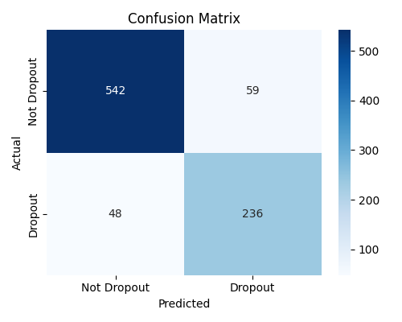
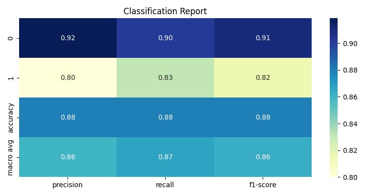
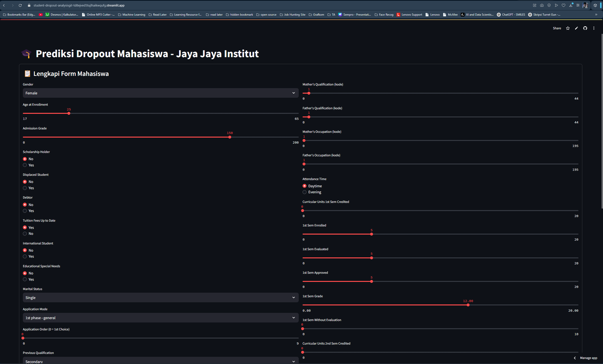

##  **Business Understanding**

###  **Latar Belakang Bisnis**

Jaya Jaya Institut merupakan institusi pendidikan tinggi yang telah lama berkontribusi dalam mencetak lulusan berkualitas. Namun, institusi ini menghadapi tantangan serius terkait **tingginya angka mahasiswa yang tidak menyelesaikan studi (dropout)**.

Fenomena dropout tidak hanya berdampak pada reputasi akademik, tetapi juga mengganggu efektivitas pengelolaan pendidikan dan menambah beban biaya operasional. Selain itu, kegagalan dalam menyelesaikan studi sering kali berdampak negatif pada masa depan mahasiswa secara pribadi dan profesional.

Untuk mengatasi tantangan ini, pihak institusi mulai memanfaatkan **pendekatan berbasis data** untuk mendeteksi risiko dropout secara dini. Dengan dukungan teknologi data science, institusi berharap dapat:

* Mengidentifikasi mahasiswa berisiko tinggi sejak awal
* Menyediakan intervensi yang tepat sasaran
* Meningkatkan tingkat kelulusan secara signifikan

Proyek ini dibangun sebagai bagian dari upaya Jaya Jaya Institut untuk **mengintegrasikan analitik prediktif** ke dalam pengambilan keputusan akademik dan manajerial.


### Permasalahan Bisnis

Jaya Jaya Institut menghadapi sejumlah tantangan utama yang memicu tingginya angka dropout mahasiswa. Permasalahan tersebut meliputi:

1. **Tingginya angka mahasiswa yang tidak menyelesaikan studi**
   Banyak mahasiswa yang tidak menyelesaikan program pendidikannya hingga lulus, yang berdampak langsung pada reputasi institusi dan efektivitas proses akademik.

2. **Belum adanya sistem prediktif untuk mendeteksi risiko dropout**
   Selama ini, proses identifikasi risiko mahasiswa masih bersifat reaktif, tanpa adanya pendekatan berbasis data yang dapat memberikan peringatan dini.

3. **Keterbatasan sumber daya dalam melakukan intervensi manual**
   Tanpa sistem otomatis, tenaga akademik dan manajemen kesulitan melakukan pemantauan secara efisien terhadap ribuan mahasiswa yang aktif setiap semester.

4. **Dampak operasional dan finansial**
   Mahasiswa yang dropout menyebabkan kehilangan potensi lulusan serta mengganggu perencanaan anggaran dan alokasi sumber daya pendidikan.

5. **Kebutuhan mendesak akan pendekatan data-driven**
   Institusi memerlukan solusi teknologi berbasis data science untuk mengidentifikasi pola risiko, melakukan prediksi, dan mendukung pengambilan keputusan secara strategis.


### Cakupan Proyek

Proyek ini dibangun sebagai solusi end-to-end berbasis data science, mulai dari eksplorasi data hingga implementasi model dalam bentuk aplikasi interaktif dan dashboard monitoring. Ruang lingkup proyek mencakup:

1. **Eksplorasi dan Pembersihan Data**

   * Menggunakan dataset berisi informasi akademik, demografis, dan sosial ekonomi mahasiswa.
   * Melakukan pengecekan nilai hilang, duplikasi, serta konsistensi data.
   * Melakukan konversi tipe data dan encoding variabel kategorikal.

2. **Analisis Eksploratori (EDA)**

   * Menganalisis distribusi data dan hubungan antar variabel.
   * Visualisasi korelasi antara fitur penting dengan status kelulusan mahasiswa (Dropout, Graduate, Enrolled).

3. **Pemodelan Prediktif**

   * Membangun model klasifikasi menggunakan XGBoost dengan optimasi hyperparameter melalui Bayesian Optimization.
   * Evaluasi model menggunakan metrik seperti akurasi, F1-score, dan ROC AUC.

4. **Interpretasi Model**

   * Mengidentifikasi fitur-fitur paling berpengaruh dalam prediksi dropout menggunakan feature importance dari XGBoost.

5. **Implementasi Aplikasi Prediksi**

   * Membuat aplikasi prediksi menggunakan Streamlit berbasis form input.
   * Menyediakan estimasi probabilitas risiko dropout untuk masing-masing input mahasiswa.

6. **Dashboard Visual Interaktif**

   * Membangun dashboard di Metabase dengan koneksi ke database Supabase PostgreSQL.
   * Menyajikan data demografis dan performa mahasiswa dalam bentuk visual interaktif untuk manajemen akademik.

7. **Rekomendasi Kebijakan**

   * Menyusun action items berdasarkan hasil analisis data dan visualisasi dashboard untuk mendukung intervensi akademik yang lebih terarah.


Berikut adalah bagian **Persiapan Proyek** yang telah disesuaikan untuk proyekmu **Prediksi Dropout Mahasiswa di Jaya Jaya Institut**:

---

## Persiapan Proyek

### 1. Sumber Data

Proyek ini menggunakan dataset pendidikan dari institusi  **Jaya Jaya Institut**, yang mencakup informasi latar belakang mahasiswa, kondisi sosial ekonomi, serta performa akademik semester awal.

* **Nama file**: `data.csv`
* **Sumber**: [Dicoding Academy Dataset - Student Performance](https://github.com/dicodingacademy/dicoding_dataset/blob/main/students_performance/data.csv)
* **Jumlah entri**: ±4.400 mahasiswa
* **Fitur**: Gender, usia, beasiswa, jurusan, nilai semester, pekerjaan orang tua, status pernikahan, dan lain-lain.

---

### 2. Membuat dan Mengaktifkan Virtual Environment

Disarankan menggunakan environment terisolasi dengan `venv` atau `conda`.

#### a. Dengan `venv`:

```bash
python -m venv venv
# Aktifkan (Windows)
venv\Scripts\activate
# Aktifkan (Mac/Linux)
source venv/bin/activate
```

#### b. Dengan `conda`:

```bash
conda create --name edu-dropout python=3.10
conda activate edu-dropout
```

---

### 3. Menginstal Dependensi

Instal semua pustaka yang dibutuhkan dari file `requirements.txt`:

```bash
pip install -r requirements.txt
```

Beberapa pustaka utama:

* `pandas`, `numpy`, `matplotlib`, `seaborn`
* `scikit-learn`, `xgboost`, `bayesian-optimization`
* `streamlit`, `joblib`, `sqlalchemy`, `psycopg2-binary`

---

### 4. Menjalankan Notebook atau Script

Proyek ini dapat dijalankan melalui notebook atau script Python biasa:

#### a. Jupyter Notebook

```bash
cd submission/
jupyter notebook
```

Buka `notebook.ipynb` di browser dan jalankan cell secara berurutan.

#### b. Python Script

```bash
python notebook.py
```

---

### 5. Menjalankan Aplikasi Prediksi (Streamlit)

Untuk mengakses aplikasi prediksi berbasis form:

```bash
streamlit run app.py
```

Aplikasi akan berjalan di `http://localhost:8501`

---

### 6. Menjalankan Dashboard Interaktif (Metabase)

Proyek ini menggunakan Metabase untuk menyajikan data interaktif.

#### Langkah setup:

```bash
docker pull metabase/metabase:v0.46.4
docker run -d -p 3000:3000 \
  -v ~/metabase-data:/metabase-data \
  -e MB_DB_FILE=/metabase-data/metabase.db \
  --name metabase metabase/metabase
```

#### Akses dashboard:

* Buka: [http://localhost:3000](http://localhost:3000)
* Login:

  ```
  Username: root@mail.com
  Password: root123
  ```

### 7. Alternatif: Akses Aplikasi Online
Prediksi bisa langsung dilakukan tanpa menjalankan lokal:
👉 [Buka Aplikasi Streamlit](https://student-dropout-analysisgit-td8ejved5tujlhaikwqufg.streamlit.app)


---

## Business Dashboard

Dashboard interaktif dibuat menggunakan Metabase untuk menyajikan berbagai insight deskriptif terkait mahasiswa di Jaya Jaya Institut. Data bersumber dari tabel `dataset_student` yang telah dimuat ke dalam Supabase PostgreSQL.

Dashboard ini memuat berbagai visualisasi penting yang dikategorikan sebagai berikut:

### Ringkasan Statistik Umum

* **Jumlah Mahasiswa**: 4.424 mahasiswa tercatat
* **Status Mahasiswa**:

  * Graduate: 2.209
  * Dropout: 1.421
  * Enrolled: 794

Dashboard menampilkan perbandingan jumlah mahasiswa berdasarkan status akademik sebagai bar chart, serta distribusi gender secara donut chart.

---

### Analisis Demografis

Visualisasi berikut membantu memahami profil dasar mahasiswa:

* **Status Pernikahan**: Mayoritas mahasiswa berstatus *Single*, dengan lebih dari 3.900 mahasiswa.
* **Jenis Kelamin**: 64.8% perempuan dan 35.2% laki-laki.
* **Kewarganegaraan**: Mayoritas berasal dari Portugal (>4.300 mahasiswa), disusul Brazil, Cape Verdean, dan negara-negara lain dalam jumlah kecil.

---

### Analisis Berdasarkan Jurusan (Course)

Distribusi mahasiswa berdasarkan jurusan ditampilkan dalam donut chart. Jurusan dengan proporsi terbesar antara lain:

* Nursing (17.3%)
* Management (8.6%)
* Social Service (8.0%)
* Veterinary Nursing, Journalism & Comm., dan jurusan lainnya

---

### Sosial Ekonomi & Risiko Akademik

Beberapa grafik berikut menampilkan hubungan antara status mahasiswa dengan faktor sosial ekonomi:

* **Debtor vs Status**: Mahasiswa yang memiliki hutang menunjukkan proporsi dropout lebih tinggi.
* **Tuition Fees Up to Date**: Siswa yang belum membayar SPP tepat waktu cenderung lebih banyak dropout.
* **Attendance Type**: Mahasiswa kelas malam memiliki dropout rate yang signifikan dibandingkan kelas siang.

---

### Latar Belakang Pendidikan

Grafik stacked bar menunjukkan hubungan antara status mahasiswa dengan latar belakang pendidikan sebelumnya (`Previous_qualification`). Mayoritas mahasiswa berasal dari pendidikan tingkat “Secondary” dengan total >3.700 siswa, di mana proporsi dropout juga tinggi.

---

### Feature Importance (Pendukung Analitik)

Meskipun dashboard ini fokus pada data eksploratif, ditambahkan juga bar chart untuk menunjukkan **feature importance** dari model XGBoost (sebagai insight tambahan). Fitur paling berpengaruh antara lain:

* `Curricular_units_2nd_sem_approved`
* `Tuition_fees_up_to_date`
* `Curricular_units_1st_sem_approved`
* `Debtor`
* `Scholarship_holder`

---

Dashboard ini bertujuan membantu manajemen Jaya Jaya Institut memahami pola dropout secara komprehensif berdasarkan demografi, sosial ekonomi, dan latar pendidikan — sebagai dasar pertimbangan untuk kebijakan pencegahan dropout.


### Cara Mengakses Dashboard

1. Buka Docker Desktop yang telah disiapkan pada tahap Setup Environment
2. Jalankan dan buka container bernama `metabase`
3. Salin alamat localhost dari container (biasanya [http://localhost:3000](http://localhost:3000))
4. Akses melalui browser dan login menggunakan akun berikut:
   * Username: [root@mail.com](mailto:root@mail.com)
   * Password: root123


## Kesimpulan Proyek

Proyek ini dikembangkan untuk membantu institusi pendidikan **Jaya Jaya Institut** dalam memahami pola dropout mahasiswa dan membangun sistem prediktif yang dapat digunakan untuk mendeteksi risiko secara dini. Dengan menerapkan pendekatan data science end-to-end, proyek ini diharapkan dapat menjadi fondasi pengambilan keputusan berbasis data dalam meningkatkan tingkat kelulusan.

### Tujuan dari Analisis Ini:

* Mengidentifikasi fitur-fitur paling berpengaruh terhadap dropout mahasiswa.
* Mengembangkan model klasifikasi yang mampu memprediksi kemungkinan dropout.
* Menyediakan aplikasi prediksi yang dapat digunakan oleh tim akademik secara praktis.
* Membantu institusi memahami faktor risiko utama dari sisi akademik, sosial ekonomi, dan demografis.
* Menyediakan dashboard visual untuk monitoring performa mahasiswa secara agregat.

---

### Ringkasan Performa Model (XGBoost + Bayesian Optimization):

* **Akurasi pada data uji**: \~88%
* **F1-score kelas dropout (positif class)**: 0.82
* **Macro average F1-score**: 0.86

#### Confusion Matrix:



Interpretasi:

* Model mampu mengenali 236 dari 284 mahasiswa yang benar-benar dropout (recall tinggi).
* False positive & false negative masih wajar dan dapat ditangani dengan strategi intervensi.

#### Classification Report:



Model memiliki performa seimbang antara presisi dan recall untuk kedua kelas (dropout dan tidak dropout), dengan hasil macro average F1-score sebesar 0.86.


### Temuan Utama dari Model:

Model XGBoost yang dibangun tidak hanya memberikan performa klasifikasi yang baik, tetapi juga memberikan kemampuan interpretasi terhadap fitur-fitur yang paling berkontribusi dalam memprediksi risiko mahasiswa dropout.

Berikut adalah 10 fitur terpenting menurut model dan interpretasinya:

<table border="1" cellspacing="0" cellpadding="6"> <thead> <tr> <th>Fitur</th> <th>Interpretasi</th> </tr> </thead> <tbody> <tr> <td>Curricular_units_2nd_sem_approved</td> <td>Semakin sedikit mata kuliah yang disetujui pada semester 2, semakin tinggi risiko dropout.</td> </tr> <tr> <td>Tuition_fees_up_to_date</td> <td>Mahasiswa yang tidak membayar SPP tepat waktu cenderung memiliki risiko dropout lebih tinggi.</td> </tr> <tr> <td>Curricular_units_1st_sem_approved</td> <td>Jumlah mata kuliah yang lulus di semester 1 sangat memengaruhi keberlangsungan studi.</td> </tr> <tr> <td>Curricular_units_1st_sem_enrolled</td> <td>Mahasiswa dengan beban studi rendah di semester 1 lebih berisiko dropout.</td> </tr> <tr> <td>Debtor</td> <td>Mahasiswa yang memiliki hutang finansial kepada institusi menunjukkan kecenderungan lebih tinggi untuk dropout.</td> </tr> <tr> <td>Scholarship_holder</td> <td>Penerima beasiswa cenderung memiliki motivasi dan dukungan untuk menyelesaikan studi.</td> </tr> <tr> <td>Curricular_units_2nd_sem_credited</td> <td>Kehadiran SKS di semester 2 juga berkontribusi terhadap status akademik mahasiswa.</td> </tr> <tr> <td>Age_at_enrollment</td> <td>Usia saat masuk perkuliahan dapat memengaruhi kesiapan dan stabilitas akademik.</td> </tr> <tr> <td>Daytime_evening_attendance</td> <td>Mahasiswa yang kuliah malam (evening class) memiliki dropout rate lebih tinggi.</td> </tr> <tr> <td>Gender</td> <td>Terdapat perbedaan proporsi dropout antara laki-laki dan perempuan yang perlu ditelusuri lebih lanjut.</td> </tr> </tbody> </table>

### Implementasi Prediksi Model
Model prediksi yang telah dibangun dapat diakses melalui aplikasi Streamlit yang menyediakan form input untuk memasukkan data mahasiswa baru. Aplikasi ini akan memberikan estimasi probabilitas risiko dropout berdasarkan fitur-fitur yang relevan.

[Prediksi Model URL](https://student-dropout-analysisgit-td8ejved5tujlhaikwqufg.streamlit.app)


## Rekomendasi Tindakan

Berdasarkan hasil analisis data dan model prediktif, berikut adalah rekomendasi yang dapat diambil oleh pihak **Jaya Jaya Institut** untuk mengurangi angka dropout dan meningkatkan tingkat kelulusan mahasiswa:

### 1. Intervensi Dini Berdasarkan Risiko Akademik

Mahasiswa dengan performa rendah pada semester 1 dan 2 (jumlah mata kuliah tidak lulus atau nilai rata-rata rendah) dapat langsung diidentifikasi untuk:

* Mendapatkan pendampingan akademik
* Diberikan opsi remedial/ulang semester
* Diikutkan dalam program mentoring senior-junior

### 2. Penguatan Dukungan Finansial

Fitur seperti `Tuition_fees_up_to_date` dan `Debtor` menunjukkan hubungan kuat dengan dropout:

* Berikan opsi pembayaran cicilan untuk mahasiswa dengan kesulitan ekonomi
* Evaluasi dan perluas akses ke program beasiswa
* Implementasi sistem peringatan dini untuk mahasiswa dengan tunggakan

### 3. Perhatian Khusus untuk Mahasiswa Kelas Malam

Mahasiswa yang mengambil kuliah malam (`Evening`) menunjukkan tingkat dropout lebih tinggi:

* Tinjau kembali beban kurikulum dan fleksibilitas jam kelas
* Sediakan layanan akademik atau psikologis di luar jam kerja reguler

### 4. Monitoring Khusus untuk Mahasiswa Non-tradisional

Fitur `Age_at_enrollment` juga memengaruhi prediksi. Mahasiswa yang masuk di usia tidak umum bisa diberikan:

* Program orientasi tambahan
* Dukungan belajar adaptif berbasis pengalaman kerja

### 5. Dashboard Monitoring Berbasis Data

Manajemen akademik disarankan untuk menggunakan dashboard Metabase yang telah disediakan untuk:

* Melacak proporsi dropout berdasarkan jurusan, gender, atau status sosial ekonomi
* Melakukan pemantauan semesteran secara rutin
* Menyusun strategi kampus berbasis data aktual
* 
### 6. Pemanfaatan Aplikasi Streamlit untuk Prediksi Individual
Aplikasi prediksi berbasis Streamlit yang telah dibangun memungkinkan pihak akademik untuk melakukan penilaian risiko dropout secara individual. Dengan memasukkan data mahasiswa, aplikasi ini akan memberikan estimasi probabilitas risiko dropout, sehingga:

* Melakukan prediksi risiko dropout secara instan berdasarkan data input manual mahasiswa
* Mengintegrasikan penilaian risiko sebagai bagian dari proses penerimaan atau evaluasi semester
* Memberikan dasar data untuk komunikasi intervensi awal antara dosen wali dan mahasiswa
Aplikasi ini dapat dijalankan secara lokal maupun diakses melalui URL cloud untuk mempermudah penggunaan tanpa instalasi.

## Executive Summary
Jaya Jaya Institut menghadapi tantangan tingginya tingkat mahasiswa yang mengalami dropout (putus kuliah) selama proses studi. Fenomena ini tidak hanya berdampak pada reputasi akademik institusi, tetapi juga mencerminkan inefisiensi dalam pengelolaan sumber daya pendidikan. Untuk menjawab tantangan ini, dilakukan sebuah proyek analisis data dengan tujuan mengidentifikasi faktor-faktor utama penyebab dropout serta membangun sistem pendukung pengambilan keputusan yang berbasis data.

Proyek ini memanfaatkan pendekatan data science dengan Python, memanfaatkan data historis mahasiswa untuk eksplorasi data, pemodelan klasifikasi menggunakan XGBoost, serta penyajian dashboard visual interaktif melalui Metabase. Aplikasi prediktif berbasis Streamlit juga dibangun untuk memudahkan pihak kampus melakukan penilaian risiko dropout secara individual.

Model terbaik yang digunakan adalah XGBoost Classifier, yang setelah optimasi mampu memprediksi risiko dropout dengan akurasi sebesar 88% dan F1-score kelas dropout sebesar 0.82. Dashboard Metabase yang dibangun memvisualisasikan tren dropout dan distribusi mahasiswa berdasarkan latar belakang akademik, demografi, serta kondisi sosial ekonomi. Aplikasi prediksi ini juga telah diimplementasikan secara online melalui antarmuka Streamlit, sehingga dapat langsung digunakan oleh pihak institusi tanpa instalasi tambahan.

Berikut adalah 10 fitur paling berpengaruh terhadap risiko dropout menurut model:

<table border="1" cellpadding="6" cellspacing="0"> <thead> <tr> <th>Fitur</th> <th>Insight Singkat</th> </tr> </thead> <tbody> <tr> <td>Curricular_units_2nd_sem_approved</td> <td>Mahasiswa yang gagal banyak mata kuliah semester 2 berisiko tinggi dropout.</td> </tr> <tr> <td>Tuition_fees_up_to_date</td> <td>Ketidakpatuhan dalam membayar SPP berhubungan erat dengan dropout.</td> </tr> <tr> <td>Curricular_units_1st_sem_approved</td> <td>Jumlah mata kuliah lulus di semester awal mencerminkan kesiapan akademik.</td> </tr> <tr> <td>Debtor</td> <td>Mahasiswa yang memiliki tunggakan keuangan cenderung tidak menyelesaikan studi.</td> </tr> <tr> <td>Scholarship_holder</td> <td>Penerima beasiswa menunjukkan tingkat kelulusan lebih tinggi secara umum.</td> </tr> <tr> <td>Curricular_units_1st_sem_enrolled</td> <td>Jumlah SKS yang diambil memengaruhi beban studi dan risiko akademik.</td> </tr> <tr> <td>Age_at_enrollment</td> <td>Usia saat masuk dapat memengaruhi kesiapan studi dan komitmen akademik.</td> </tr> <tr> <td>Daytime_evening_attendance</td> <td>Mahasiswa kelas malam cenderung memiliki risiko dropout yang lebih tinggi.</td> </tr> <tr> <td>Curricular_units_2nd_sem_credited</td> <td>Kemajuan studi di semester 2 menjadi indikator kuat keberlanjutan studi.</td> </tr> <tr> <td>Gender</td> <td>Terdapat perbedaan pola dropout antara mahasiswa laki-laki dan perempuan.</td> </tr> </tbody> </table>
Sebagai hasil akhir, seluruh pipeline telah dirancang secara modular, mulai dari preprocessing data, pelatihan model, aplikasi prediksi berbasis Streamlit, hingga visualisasi monitoring dengan dashboard Metabase. Data yang telah dibersihkan disimpan dalam file preprocessed_train.csv dan preprocessed_test.csv, dan sistem ini siap digunakan secara operasional oleh pihak akademik untuk menurunkan angka dropout secara bertahap.
